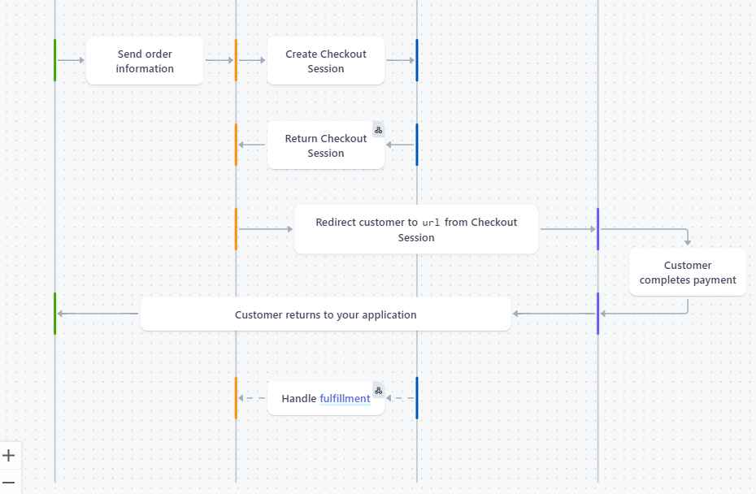

# <h1>code-indrome-I-O-</h1>

# <h2>Chemical Market Place</h2>

An e-commerce platform that allows chemical sellers to list products and buyers to purchase them. The platform includes user authentication, email verification, product management, Stripe-based payment integration, and user-friendly interfaces for buyers and sellers.

## Tech Stack

- **Frontend**: React+vite, Tailwind CSS
- **Backend**: Node.js, Express.js
- **Database**: MongoDB
- **Authentication**: JWT & Cookies
- **Email Services**: Nodemailer
- **Payments**: Stripe API

## Features

- Secure registration & login (JWT-based)
- Email verification using Nodemailer
- Buyer/Seller role separation
- Sellers can manage product listings
- Buyers can add products to cart and checkout via Stripe
- Real-time payment confirmation
- Mobile-responsive UI

## Live Website

[Click here to visit chemicalMarketplace](https://heroic-kitsune-a6f0c0.netlify.app/)

## How to Use the Website

- **Register** as a buyer or seller using your email (includes email verification).
- **Sellers** can add, update, or remove products.
- **Buyers** can browse products, add to cart, and make secure payments via Stripe.
- All users can manage their account and view order history.

## Stripe Payment Workflow

- Test card for India: `4000 0035 6000 0008`

